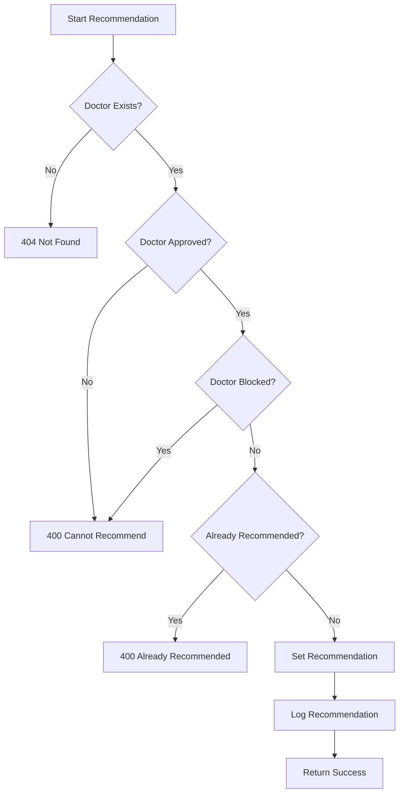

# Doctor Recommendation System Documentation

## Overview

The Doctor Recommendation System allows administrators and authorized supervisors to recommend exceptional doctors to clients. This feature helps highlight high-quality healthcare providers and improves the client experience by showcasing trusted professionals.

---

## 1. Database Schema Changes

### User Model Enhancements

Added new fields to the User model for doctor recommendations:

```javascript
// Recommendation fields (only for doctors)
isRecommended: {
  type: Boolean,
  default: false,
  required: function() {
    return this.role === 'doctor';
  }
},
recommendedAt: {
  type: Date,
  required: function() {
    return this.isRecommended && this.role === 'doctor';
  }
},
recommendedBy: {
  type: mongoose.Schema.Types.ObjectId,
  ref: 'User',
  required: function() {
    return this.isRecommended && this.role === 'doctor';
  }
},
recommendationReason: {
  type: String,
  maxlength: [500, 'Recommendation reason cannot exceed 500 characters'],
  required: function() {
    return this.isRecommended && this.role === 'doctor';
  }
}
```

### Database Indexes

Added performance indexes for recommendation queries:

```javascript
// Indexes for doctor recommendations
userSchema.index({ role: 1, isRecommended: 1 });
userSchema.index({ isRecommended: 1, recommendedAt: -1 });
userSchema.index({ recommendedBy: 1, recommendedAt: -1 });
```

---

## 2. Permission System Integration

### New Permissions

| Permission | Level | Description | Risk Level |
|------------|-------|-------------|------------|
| `recommend_doctor` | 3 | Ability to recommend doctors to clients | Medium |
| `unrecommend_doctor` | 3 | Ability to remove doctor recommendations | Medium |

### Role-Based Access

| Role | Recommend | Unrecommend | View Recommended |
|------|-----------|-------------|-----------------|
| Client | ❌ | ❌ | ✅ (public) |
| Doctor | ❌ | ❌ | ✅ (public) |
| Supervisor | ✅ (with permission) | ✅ (with permission) | ✅ (public) |
| Admin | ✅ (automatic) | ✅ (automatic) | ✅ (public) |

### Granting Permissions to Supervisors

Admins can grant recommendation permissions to supervisors:

```http
POST /api/permissions/grant
{
  "userId": "supervisor123",
  "permissionName": "recommend_doctor",
  "reason": "Grant ability to recommend exceptional doctors"
}
```

```http
POST /api/permissions/grant
{
  "userId": "supervisor123",
  "permissionName": "unrecommend_doctor",
  "reason": "Grant ability to manage doctor recommendations"
}
```

---

## 3. API Endpoints

### 3.1 Recommend Doctor

#### Endpoint
```
POST /api/doctors/:doctorId/recommend
```

#### Purpose
Mark a doctor as recommended, making them highlighted for clients seeking quality healthcare providers.

#### Authentication & Authorization
- **Required**: Valid JWT authentication
- **Permission Required**: `recommend_doctor`
- **Roles**: Admin (automatic), Supervisor (with granted permission)

#### Path Parameters
- `doctorId` (required): MongoDB ObjectId of the doctor to recommend

#### Request Body

```json
{
  "reason": "Exceptional patient care and expertise in sports nutrition"
}
```

#### Request Parameters

- **reason** (optional): Reason for recommendation (3-500 characters)

#### Validation Rules

1. **Doctor Status Validation**
   - Doctor must exist and have `role: 'doctor'`
   - Doctor must be approved (`status: 'approved'`)
   - Doctor must not be blocked (`isBlocked: false`)
   - Doctor must not be deleted (`isDeleted: false`)
   - Doctor must not already be recommended

#### Response Structure

```json
{
  "success": true,
  "message": "Doctor recommended successfully",
  "data": {
    "doctor": {
      "id": "507f1f77bcf86cd799439011",
      "name": "Dr. Sarah Johnson",
      "email": "sarah@example.com",
      "specialization": "nutritionist",
      "isRecommended": true,
      "recommendedAt": "2024-01-15T10:30:00.000Z",
      "recommendationReason": "Exceptional patient care and expertise in sports nutrition"
    },
    "recommendedBy": {
      "id": "507f1f77bcf86cd799439015",
      "name": "Admin User",
      "email": "admin@example.com",
      "role": "admin"
    },
    "recommendedAt": "2024-01-15T10:30:00.000Z",
    "reason": "Exceptional patient care and expertise in sports nutrition"
  }
}
```

#### Error Responses

```json
{
  "success": false,
  "error": "Doctor not found"
}
```

```json
{
  "success": false,
  "error": "Cannot recommend a doctor that is not approved"
}
```

```json
{
  "success": false,
  "error": "Doctor is already recommended"
}
```

---

### 3.2 Unrecommend Doctor

#### Endpoint
```
DELETE /api/doctors/:doctorId/recommend
```

#### Purpose
Remove a doctor's recommendation status, effectively unhighlighting them from the recommended list.

#### Authentication & Authorization
- **Required**: Valid JWT authentication
- **Permission Required**: `unrecommend_doctor`
- **Roles**: Admin (automatic), Supervisor (with granted permission)

#### Path Parameters
- `doctorId` (required): MongoDB ObjectId of the doctor to unrecommend

#### Request Body

```json
{
  "reason": "Review of recommendation criteria"
}
```

#### Request Parameters

- **reason** (optional): Reason for removing recommendation (3-500 characters)

#### Response Structure

```json
{
  "success": true,
  "message": "Doctor recommendation removed successfully",
  "data": {
    "doctor": {
      "id": "507f1f77bcf86cd799439011",
      "name": "Dr. Sarah Johnson",
      "email": "sarah@example.com",
      "specialization": "nutritionist",
      "isRecommended": false
    },
    "unrecommendedBy": {
      "id": "507f1f77bcf86cd799439015",
      "name": "Admin User",
      "email": "admin@example.com",
      "role": "admin"
    },
    "unrecommendedAt": "2024-01-20T14:45:00.000Z",
    "reason": "Review of recommendation criteria",
    "previousRecommendation": {
      "recommendedAt": "2024-01-15T10:30:00.000Z",
      "recommendedBy": "507f1f77bcf86cd799439015",
      "reason": "Exceptional patient care and expertise in sports nutrition"
    }
  }
}
```

---

### 3.3 Get Recommended Doctors

#### Endpoint
```
GET /api/doctors/recommended
```

#### Purpose
Retrieve all recommended doctors with filtering and pagination. This endpoint is publicly accessible to all authenticated users.

#### Authentication & Authorization
- **Required**: Valid JWT authentication
- **Permission Required**: None (publicly accessible to all authenticated users)

#### Query Parameters

#### Pagination
- `page` (optional): Page number (default: 1, min: 1)
- `limit` (optional): Items per page (default: 20, min: 1, max: 100)

#### Filtering Options
- `specialization` (optional): Filter by doctor specialization
- `search` (optional): Search by name, email, or bio (case-insensitive)

#### Response Structure

```json
{
  "success": true,
  "data": {
    "doctors": [
      {
        "_id": "507f1f77bcf86cd799439011",
        "name": "Dr. Sarah Johnson",
        "email": "sarah@example.com",
        "specialization": "nutritionist",
        "short_bio": "Specialized in sports nutrition with 10+ years experience",
        "years_of_experience": 12,
        "region": "Cairo",
        "profilePicture": {
          "secure_url": "https://example.com/profile.jpg"
        },
        "isRecommended": true,
        "recommendedAt": "2024-01-15T10:30:00.000Z",
        "recommendedBy": {
          "name": "Admin User",
          "email": "admin@example.com"
        },
        "recommendationReason": "Exceptional patient care and expertise in sports nutrition",
        "status": "approved",
        "packages": [
          {
            "duration": 1,
            "price": 150
          },
          {
            "duration": 3,
            "price": 400
          }
        ]
      }
    ],
    "pagination": {
      "currentPage": 1,
      "totalPages": 3,
      "totalDoctors": 45,
      "hasNext": true,
      "hasPrev": false
    },
    "statistics": {
      "totalRecommended": 45,
      "specializationStatistics": [
        {
          "_id": "nutritionist",
          "count": 25,
          "oldestRecommendation": "2023-06-01T09:00:00.000Z",
          "newestRecommendation": "2024-01-20T14:45:00.000Z"
        },
        {
          "_id": "doctor",
          "count": 15,
          "oldestRecommendation": "2023-07-15T11:30:00.000Z",
          "newestRecommendation": "2024-01-18T16:20:00.000Z"
        },
        {
          "_id": "therapist",
          "count": 5,
          "oldestRecommendation": "2023-09-10T13:45:00.000Z",
          "newestRecommendation": "2024-01-12T10:15:00.000Z"
        }
      ],
      "overallStats": {
        "totalRecommended": 45,
        "avgRecommendationAge": 2592000000
      }
    },
    "filters": {
      "specialization": null,
      "search": null
    }
  }
}
```

#### Usage Examples

##### Get all recommended doctors
```http
GET /api/doctors/recommended
```

##### Filter by specialization
```http
GET /api/doctors/recommended?specialization=nutritionist
```

##### Search recommended doctors
```http
GET /api/doctors/recommended?search=sarah
```

##### Paginated results
```http
GET /api/doctors/recommended?page=2&limit=10
```

---

## 4. Business Logic & Validation

### Recommendation Criteria

A doctor can only be recommended if they meet ALL of these criteria:

1. **Role Validation**: Must have `role: 'doctor'`
2. **Approval Status**: Must have `status: 'approved'`
3. **Active Status**: Must have `isBlocked: false`
4. **Not Deleted**: Must have `isDeleted: false`
5. **Not Already Recommended**: Must have `isRecommended: false`

### Recommendation Process Flow



### Audit Trail

All recommendation actions are logged with:

- **Who performed the action** (user ID, name, role)
- **Which doctor was affected** (doctor ID, name, specialization)
- **When the action occurred** (timestamp)
- **Why the action was taken** (reason)
- **Previous state** (for unrecommendations)

---

## 5. Performance Considerations

### Database Optimization

1. **Indexes**: Optimized indexes for recommendation queries
2. **Pagination**: Efficient pagination for large doctor lists
3. **Population**: Selective field population to reduce data transfer
4. **Lean Queries**: Use lean queries for better performance

### Caching Strategy

1. **Recommended Doctors Cache**: Cache frequently accessed recommended doctors
2. **Statistics Cache**: Cache recommendation statistics
3. **Cache Invalidation**: Invalidate cache when recommendations change

### Query Optimization

```javascript
// Optimized query for recommended doctors
const query = {
  role: 'doctor',
  isRecommended: true,
  isDeleted: { $ne: true },
  status: 'approved',
  isBlocked: { $ne: true }
};

// Efficient aggregation for statistics
const stats = await User.aggregate([
  { $match: query },
  {
    $group: {
      _id: '$specialization',
      count: { $sum: 1 },
      oldestRecommendation: { $min: '$recommendedAt' },
      newestRecommendation: { $max: '$recommendedAt' }
    }
  },
  { $sort: { count: -1 } }
]);
```

---

## 6. Security & Compliance

### Security Measures

1. **Permission Validation**: Strict permission checking for all operations
2. **Input Validation**: Comprehensive validation of all inputs
3. **Audit Logging**: Complete audit trail for all recommendation actions
4. **Data Sanitization**: Proper data sanitization in responses

### Compliance Features

1. **Data Privacy**: Only expose necessary doctor information
2. **Consent Management**: Recommendations are admin-driven
3. **Transparency**: Clear recommendation reasons and timestamps
4. **Accountability**: Full audit trail of who recommended whom and why

### Access Control

```javascript
// Permission middleware example
router.post('/:doctorId/recommend',
  requirePermission('recommend_doctor'),
  // Additional validation
  doctorController.recommendDoctor
);
```

---

## 7. Monitoring & Analytics

### Key Metrics

1. **Recommendation Statistics**
   - Total number of recommended doctors
   - Recommendations by specialization
   - Average recommendation age
   - Recommendation frequency over time

2. **User Engagement**
   - How often clients view recommended doctors
   - Conversion rates for recommended doctors
   - Client feedback on recommendations

3. **System Performance**
   - API response times
   - Database query performance
   - Cache hit/miss ratios

### Recommended Dashboards

#### Admin Dashboard
- Total recommended doctors
- Recent recommendations
- Recommendation distribution by specialization
- Recommendation activity timeline

#### Recommendation Quality Metrics
- Client satisfaction with recommended doctors
- Retention rates for recommended doctors
- Performance comparison: recommended vs non-recommended

---

## 8. Best Practices

### Recommendation Guidelines

1. **Quality Standards**
   - Only recommend doctors with proven track records
   - Consider client feedback and performance metrics
   - Review recommendations regularly

2. **Diversity & Fairness**
   - Ensure diverse representation across specializations
   - Avoid favoritism in recommendations
   - Consider regional distribution

3. **Transparency**
   - Provide clear reasons for recommendations
   - Make recommendation criteria public
   - Allow client feedback on recommendations

### Operational Guidelines

1. **Regular Reviews**
   - Review recommendations quarterly
   - Remove outdated recommendations
   - Update recommendation criteria as needed

2. **Performance Monitoring**
   - Track recommendation effectiveness
   - Monitor client engagement
   - Adjust strategy based on data

3. **Communication**
   - Notify doctors when they are recommended
   - Provide feedback on recommendation performance
   - Maintain clear documentation

---

## 9. Troubleshooting

### Common Issues

#### Recommendation Not Working
1. Verify user has required permission
2. Check if doctor meets all criteria
3. Review doctor status (approved, not blocked)
4. Check if doctor is already recommended

#### Performance Issues
1. Check database indexes
2. Verify cache configuration
3. Monitor query performance
4. Review pagination settings

#### Data Inconsistency
1. Check for concurrent modifications
2. Verify database transactions
3. Review audit logs for errors
4. Check data integrity

### Debug Tools

```javascript
// Check doctor recommendation status
const doctor = await User.findById(doctorId);
console.log('Doctor recommendation status:', {
  isRecommended: doctor.isRecommended,
  recommendedAt: doctor.recommendedAt,
  recommendedBy: doctor.recommendedBy,
  status: doctor.status,
  isBlocked: doctor.isBlocked
});

// Test permission check
const hasPermission = await PermissionService.checkUserPermission(
  userId,
  'recommend_doctor'
);
console.log('Can recommend doctor:', hasPermission);

// Get recommendation statistics
const stats = await User.aggregate([
  { $match: { role: 'doctor', isRecommended: true } },
  { $group: { _id: '$specialization', count: { $sum: 1 } } }
]);
console.log('Recommendations by specialization:', stats);
```

---

## 10. API Reference Summary

### Endpoints Summary

| Method | Endpoint | Purpose | Permission Required |
|--------|----------|---------|---------------------|
| POST | `/api/doctors/:doctorId/recommend` | Recommend doctor | `recommend_doctor` |
| DELETE | `/api/doctors/:doctorId/recommend` | Remove recommendation | `unrecommend_doctor` |
| GET | `/api/doctors/recommended` | Get recommended doctors | None (public) |

### Response Formats

#### Success Response
```json
{
  "success": true,
  "message": "Operation completed successfully",
  "data": { ... }
}
```

#### Error Response
```json
{
  "success": false,
  "error": "Error description",
  "details": { ... } // Additional error details
}
```

### HTTP Status Codes

- `200` - Success
- `400` - Bad Request (validation errors)
- `403` - Forbidden (insufficient permissions)
- `404` - Not Found (resource doesn't exist)
- `500` - Internal Server Error

---

## 11. Integration Examples

### Frontend Integration

```javascript
// Recommend a doctor
async function recommendDoctor(doctorId, reason) {
  const response = await fetch(`/api/doctors/${doctorId}/recommend`, {
    method: 'POST',
    headers: {
      'Authorization': `Bearer ${token}`,
      'Content-Type': 'application/json'
    },
    body: JSON.stringify({ reason })
  });
  
  if (!response.ok) {
    const error = await response.json();
    throw new Error(error.error || 'Failed to recommend doctor');
  }
  
  return response.json();
}

// Get recommended doctors
async function getRecommendedDoctors(filters = {}) {
  const params = new URLSearchParams(filters);
  const response = await fetch(`/api/doctors/recommended?${params}`, {
    headers: {
      'Authorization': `Bearer ${token}`
    }
  });
  
  if (!response.ok) {
    throw new Error('Failed to fetch recommended doctors');
  }
  
  return response.json();
}

// Unrecommend a doctor
async function unrecommendDoctor(doctorId, reason) {
  const response = await fetch(`/api/doctors/${doctorId}/recommend`, {
    method: 'DELETE',
    headers: {
      'Authorization': `Bearer ${token}`,
      'Content-Type': 'application/json'
    },
    body: JSON.stringify({ reason })
  });
  
  if (!response.ok) {
    const error = await response.json();
    throw new Error(error.error || 'Failed to unrecommend doctor');
  }
  
  return response.json();
}
```

### Usage Examples

```javascript
// Example: Admin dashboard recommendation management
class DoctorRecommendationManager {
  async loadRecommendedDoctors() {
    try {
      const result = await getRecommendedDoctors({
        page: 1,
        limit: 20
      });
      
      this.displayRecommendedDoctors(result.data.doctors);
      this.displayStatistics(result.data.statistics);
    } catch (error) {
      console.error('Failed to load recommended doctors:', error);
      this.showError('Failed to load recommended doctors');
    }
  }
  
  async recommendDoctor(doctorId, reason) {
    try {
      await recommendDoctor(doctorId, reason);
      this.showSuccess('Doctor recommended successfully');
      this.loadRecommendedDoctors(); // Refresh list
    } catch (error) {
      console.error('Failed to recommend doctor:', error);
      this.showError(error.message);
    }
  }
  
  async unrecommendDoctor(doctorId, reason) {
    try {
      await unrecommendDoctor(doctorId, reason);
      this.showSuccess('Doctor recommendation removed');
      this.loadRecommendedDoctors(); // Refresh list
    } catch (error) {
      console.error('Failed to unrecommend doctor:', error);
      this.showError(error.message);
    }
  }
}
```

---

## 12. Future Enhancements

### Planned Features

1. **Client Feedback System**
   - Allow clients to rate recommended doctors
   - Collect feedback on recommendation quality
   - Use feedback to improve recommendation algorithm

2. **Automated Recommendations**
   - AI-powered recommendation system
   - Performance-based recommendations
   - Automatic suggestion system

3. **Recommendation Analytics**
   - Advanced analytics dashboard
   - Recommendation effectiveness tracking
   - A/B testing for recommendation strategies

4. **Mobile App Integration**
   - Push notifications for new recommendations
   - Mobile-optimized recommendation display
   - Offline recommendation caching

### Scalability Considerations

1. **Database Scaling**
   - Horizontal scaling for large doctor databases
   - Read replicas for recommendation queries
   - Optimized sharding strategies

2. **Caching Strategy**
   - Redis caching for recommended doctors
   - CDN integration for static content
   - Edge caching for global performance

3. **API Performance**
   - GraphQL for efficient data fetching
   - Response compression
   - Connection pooling

---

*This documentation covers the complete Doctor Recommendation System. Ensure proper training and authorization before using these recommendation features.*
